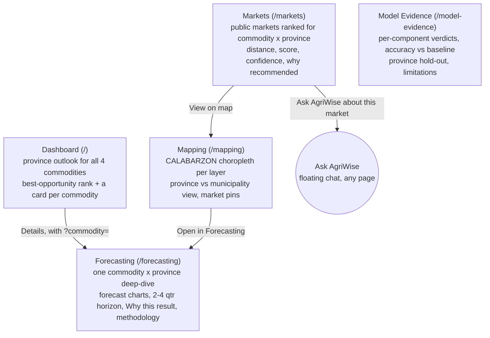
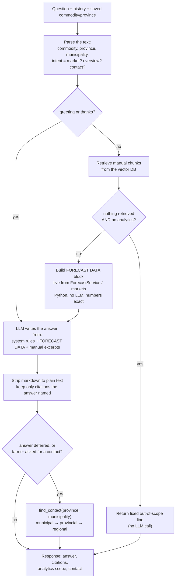
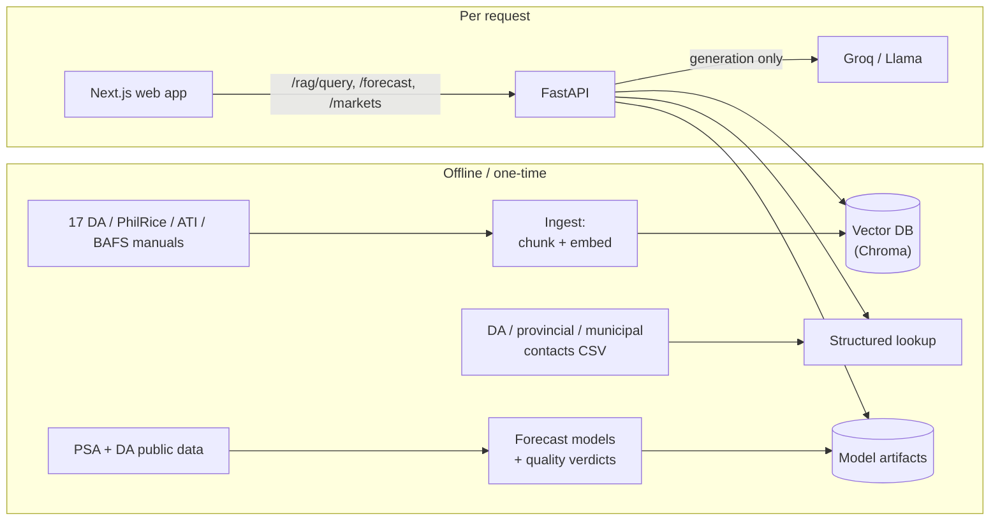

# AgriWise — Overall User Flow

_Current state. No account, no login. Mobile-first web app._

---

## 1. Who uses it

| Actor | Goal |
|---|---|
| **Smallholder farmer** (often ~50, on a phone, Tagalog/Taglish) | "Should I plant / spray / sell? What's wrong with my crop? Who do I call?" |
| **Agricultural extension worker (AEW)** | Same questions, plus checking the evidence behind a forecast before advising a farmer. |

Both share one entry point and one assistant.

---

## 2. Entry & navigation

```
Open the web app  →  lands on the Dashboard (route "/"). No login, no onboarding.
        │
        ▼
Pick a commodity + province once  ──►  saved in the browser (localStorage key
(dropdowns on almost every page)       "agriwise.preferences"), shared across
                                       every page AND the chatbot
        │
        ▼
Sidebar rail (desktop) / bottom tab bar (mobile):
    Dashboard  ·  Forecasting  ·  Mapping  ·  Markets      (primary)
    Model Evidence                                          (behind "More")

Floating "Ask AgriWise" button — on EVERY page, opens the chat panel in place.
The chat also has its own full page at /chat (not in the nav).
```

There are two ways to get an answer:

- **Explore the analytics** (the pages) — for someone who wants to see the numbers.
- **Ask the assistant** (the floating chat, on any page) — for someone who just
  wants an answer in words.

---

## 3. Flow A — Exploring the analytics



- Every page is honest about gaps: a component with no usable model shows
  **"not available"**, never a fabricated number.
- Model Evidence is the "show your work" page — mainly for extension workers
  checking a forecast before advising a farmer.
- _Note: the `?about=` (Markets→Chat) and `?market=` (Markets→Mapping) params are
  placeholders — the target pages don't yet read them, so those links open the
  page without pre-filling. Small follow-up._

---

## 4. Flow B — Asking the assistant (the core loop)

```
Farmer opens "Ask AgriWise"  →  first message is a warm intro
        │
        ▼
Farmer types a question (English / Tagalog / Taglish)
        │
        ▼
┌─────────────────────────────────────────────────────────────┐
│  BACKEND decides what the question needs (see §5)            │
│   • greeting / thanks            → warm reply, nothing else  │
│   • off-topic (code, trivia…)    → one-line refusal          │
│   • a number question            → live forecast figures     │
│   • where-to-sell                → ranked markets            │
│   • a how-to question            → DA manual excerpts         │
│   • a mix                        → both, forecast leads on #s │
│   • can't answer                 → hand off to a real office  │
└─────────────────────────────────────────────────────────────┘
        │
        ▼
Answer comes back as plain text, in the farmer's language, phone-short:
   ├─ the answer
   ├─ source citations   (only the manuals the answer actually used)
   ├─ "Answer used AgriWise analytics — Rice · Laguna"   (when figures were used)
   └─ Contact card       (name / phone / email of the right DA office —
                          only when the bot couldn't fully answer, or was asked)
        │
        ▼
Farmer taps ☎ to call, or asks a follow-up (history is kept)
```

### The branches, with examples

| Farmer says | What they get back |
|---|---|
| "kumusta" | Warm one-line intro. No citations. |
| "write me python code" | "I can only help with CALABARZON farming…" (never reaches the LLM). |
| "price outlook for rice in Laguna" | Forecast figures, per quarter. Footnote: _used AgriWise analytics — Rice · Laguna_. No manual citations. |
| "which markets for selling tomatoes in Laguna?" | Top 5 Laguna markets ranked + the tomato price outlook. |
| "how do I control stem borer in rice?" | Steps from the rice field guide, cited with the page. |
| "is now a good time to plant tomato in Cavite, and how do I prepare the seedbed?" | Forecast says whether it's a good time; manual says how to prepare — one answer. |
| "my soil has a white crust — what is it?" | "The manuals don't cover this…" **+ a contact card** for the provincial / municipal agriculture office. |
| "who can I call about my sick plants?" | Direct answer + contact card. |

---

## 5. Inside one chat message (backend decision flow)



**Key guarantee:** the LLM never computes a number. Python pulls the exact
figure from the same `ForecastService` the dashboard renders and pastes it in
as text; the model only phrases it.

---

## 6. System flow behind it



- **Vector DB**: only the manuals. Forecasts and contacts are **not** embedded —
  they're structured lookups, fetched live and exact.
- **Paid dependency**: only the generation API. Retrieval, embeddings, forecasts,
  and contact lookup all run locally.
- **Deterministic where it can be**: greetings, refusals, the "out of scope"
  reply, and every number skip or bypass the LLM.

---

## 7. One-line summary

> A farmer opens the app, sets their crop and province once, and can either
> browse the province's forecast/market analytics or just ask the assistant.
> The assistant answers in plain Tagalog from the DA manuals and the live
> local numbers, cites its sources, admits what it doesn't know, and hands the
> farmer a real extension officer to call when the book runs out.
